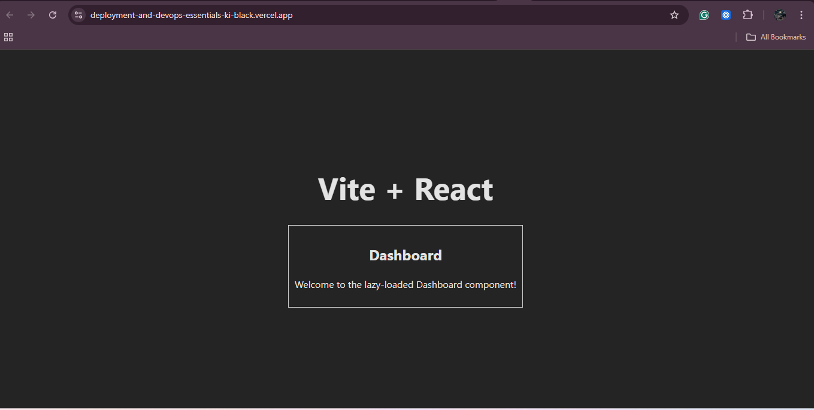
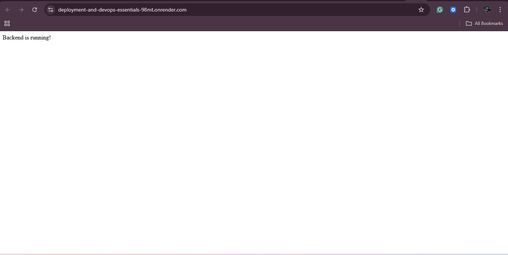
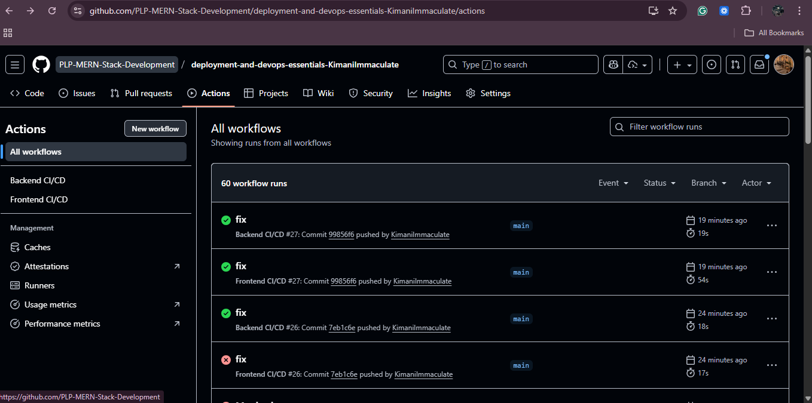

# Deployment and DevOps Essentials — MERN Stack Application

[](https://github.com/PLP-MERN-Stack-Development/deployment-and-devops-essentials-KimaniImmaculate/actions/workflows/frontend.yml)  
[](https://github.com/PLP-MERN-Stack-Development/deployment-and-devops-essentials-KimaniImmaculate/actions/workflows/backend.yml)


This repository contains a production-ready MERN application that demonstrates deployment, CI/CD, monitoring, and basic performance management practices. It includes a Vite React frontend, an Express backend connecting to MongoDB Atlas, and example GitHub Actions workflows for automated builds and deployments.

---

## Table of Contents

- **Overview**
- **Features**
- **Project Structure**
- **Environment Setup**
- **Installation & Running Locally**
- **Deployment**
- **CI/CD Pipeline**
- **Monitoring & Maintenance**
- **Technologies Used**
- **Screenshots & Assets**

---

## Overview

This project is a small full-stack MERN (MongoDB, Express, React, Node) application prepared for demonstration and teaching of deployment and DevOps fundamentals. The app is intentionally simple so the focus remains on the operational concerns: build pipelines, secure configuration, observability, and hosting.

Use this repository as a reference to:

- Structure a production-ready frontend and backend
- Configure environment variables for dev/staging/production
- Add lightweight monitoring and health checks
- Implement CI/CD workflows that build, test, lint, and deploy

## Features

- Frontend
	- React app built with Vite for fast builds and HMR in development
	- Code splitting via dynamic imports to reduce initial bundle size
	- Environment variables per environment (`.env` / Vite `VITE_` variables)

- Backend
	- Express server with Helmet for secure HTTP headers
	- CORS enabled and configurable
	- Request logging with Morgan
	- Centralized error handling middleware
	- MongoDB Atlas connection with connection pooling
	- Health check endpoint: `GET /health`
	- Slow-request logging middleware (requests > 500ms)

- CI/CD & DevOps
	- GitHub Actions workflows for frontend and backend
	- Linting with ESLint
	- Build and deploy steps for Vercel (frontend) and Render (backend)

## Project Structure

```
deployment-and-devops-essentials/
│
├─ backend/
│  ├─ server.js
│  ├─ package.json
│  ├─ .env
│  └─ src/
│     ├─ db.js
│     └─ logger.js
│
├─ frontend/
│  ├─ src/
│  ├─ public/
│  ├─ package.json
│  └─ .env
│
├─ .github/
│  └─ workflows/
│     ├─ frontend.yml
│     └─ backend.yml
│
├─ assets/
│     ├─ render.png
│     ├─vercel.png
│     └─ workflows.png
│
└─ README.md
```

## Environment Setup

Create `.env` files locally (do NOT commit them).

Backend (`backend/.env`):

```
PORT=5000
MONGO_URI=your_mongo_atlas_uri
NODE_ENV=development
```

Frontend (`frontend/.env`):

```
VITE_API_URL=https://your-backend.onrender.com
```

Notes:

- Use your hosting provider (Render/Vercel) secrets for production variables.
- Never commit secrets or `.env` files to Git.

## Installation & Running Locally

Backend (development):

```powershell
cd backend
npm install
npm run dev
```

Frontend (development - Vite):

```powershell
cd frontend
npm install
npm run dev
```

Open the frontend at `http://localhost:5173` (Vite default). Ensure `VITE_API_URL` points to the backend dev URL.

## Deployment

This project was demonstrated using the following hosting platforms; replace the placeholder URLs below with your actual deployments:

- **Frontend (Vercel)**: `https://deployment-and-devops-essentials-ki-black.vercel.app/`
- **Backend (Render)**: `https://deployment-and-devops-essentials-98mt.onrender.com/`

Tips for production:

- Configure HTTPS and environment variables in the hosting dashboard.
- Set up branch protections and required status checks in GitHub before enabling auto-deploy to production.

## CI/CD Pipeline

Workflows live in `.github/workflows`.

Typical steps contained in each workflow:

- Checkout repository
- Set up Node.js
- Install dependencies
- Run lint (`npm run lint`)
- Run tests (if present)
- Build the project
- Deploy to hosting provider (Vercel/Render)

You can extend the workflows to run integration tests, create release artifacts, or publish container images.

## Monitoring & Maintenance

- **Health endpoint:** `GET /health` should return a 200 status and a JSON payload showing service and dependency status.
- **Request logging:** Morgan emits request logs; combine with structured logging for production (JSON output)
- **Slow request logging:** middleware logs requests taking longer than a configured threshold (default 500ms)
- **Database:** Use MongoDB Atlas connection pooling, least-privilege users, and enable automated backups and alerts

Operational checklist:

- Forward logs to a centralized log store or platform (Render logs, Datadog, Logflare, etc.)
- Add basic metrics (request rate, error rate, p95 latency) and alerting
- Keep dependencies patched and use Dependabot or similar for automated updates

## Screenshots & Assets

- `assets/vercel.png` — frontend UI capture
- `assets/render.png` — backend logs / health endpoint capture
- `assets/workflows.png` — GitHub Actions / CI pipeline capture

Example markdown for embedding:

```markdown




```


